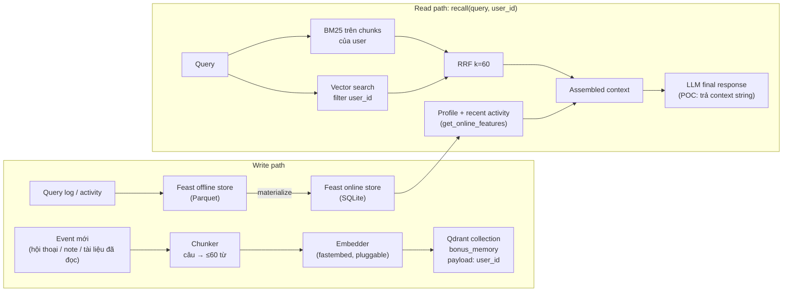

# Bonus Challenge — Kiến trúc memory cho trợ lý AI cá nhân (tiếng Việt)

**Contributors:** Nguyễn Quang Huy (làm cá nhân).
**Chạy thử:** `python bonus/demo.py` (không cần service ngoài; Qdrant chạy in-process, Feast đọc online store SQLite đã materialize từ NB4).

## Sơ đồ kiến trúc

Data flow tách đôi có chủ đích: **episodic memory** (thay đổi liên tục,
search theo ngữ nghĩa) đi qua vector store; **stable profile + recent
activity** (dạng cột, đọc theo entity) đi qua feature store. LLM nhận cả
hai: top-K memories + profile line + activity line.

## 3 quyết định kiến trúc

### 1. Chunking: fixed-size theo câu, ≤60 từ — không per-message, không semantic

| Lựa chọn | Ưu | Nhược |
|---|---|---|
| Per-message | biên tự nhiên | message chat dài/ngắn cực thất thường → vector đại diện pha tạp, retrieval noise |
| Per-conversation | ngữ cảnh trọn vẹn | 1 chunk 2000+ từ → vượt context window khi trả về nhiều hit; embedding "loãng", recall kém |
| Semantic break (LLM) | biên đúng nghĩa nhất | thêm latency + chi phí LLM ở write path; POC cần chạy được offline |
| **Fixed ≤60 từ, cắt theo câu** | biên không cắt giữa câu; kích thước đều → embedding ổn định; storage rẻ (payload ~60 từ/chunk) | có thể tách 2 ý liên quan ra 2 chunk → RRF + top-K=3 bù lại |

Chọn fixed-size vì tradeoff nghiêng hẳn về phía nó ở quy mô POC: retrieval
quality ổn định, storage cost ~tuyến tính theo số từ, mỗi 3 hit trả về chỉ
chiếm ~180 từ context window. Nếu sau này memory nhiều, nâng cấp lên
semantic break là thay cục bộ trong `chunk_text()`, không đụng read path.

### 2. Feature schema: tabular trước, embedding-feature để sau

| Feature | Entity | TTL | Source | Refresh |
|---|---|---|---|---|
| `preferred_language` (vi/en/mix) | user | 30 ngày | profile batch | daily |
| `topic_affinity` | user | 30 ngày | profile batch | daily |
| `reading_speed_wpm` | user | 30 ngày | profile batch | daily |
| `queries_last_hour` | user | 1 giờ | activity log | (ideally) streaming push |
| `distinct_topics_24h` | user | 1 giờ | activity log | (ideally) streaming push |

TTL chọn theo tốc độ đổi của dữ liệu — đúng pattern NB4: profile chậm → TTL
30d, activity nhanh → TTL 1h (hết hạn là mất, không đọc nhầm giá trị cũ).
Chọn **tabular** thay vì embedding feature (latent prefs từ history) vì:
feature tabular debug được ("user này affinity=cloud, đọc 187wpm" — nói
chuyện với user được), write path đơn giản; latent embedding khó giải thích
và chỉ đáng tiền khi có đủ dữ liệu + bài toán re-ranking cá nhân hoá.

### 3. Freshness: 3 tầng cho 3 use case

| Use case | Freshness cần | Cơ chế |
|---|---|---|
| User vừa note "tôi quan tâm X" xong hỏi lại ngay | **Sub-second** | Streaming push (Feast Push API) cập nhật online store tức thì |
| "Tôi đang quan tâm gì gần đây?" (`queries_last_hour`) | ~5 phút | Batch refresh mỗi 5 phút là đủ — cửa sổ 1h không cần chính xác giây |
| `topic_affinity`, ngôn ngữ ưu tiên | Daily | Batch refresh hằng đêm — profile đổi theo tuần, refresh dày là phí compute |

POC này chạy tầng daily/5-min (materialize từ file). Tầng streaming là
thiết kế, chưa implement — ghi rõ ở Limitations.

## Lựa chọn bị loại bỏ

Tôi **xem xét lưu episodic memory làm embedding feature view trong Feast**
(mỗi user 1 vector "latent prefs"), nhưng **chọn tách riêng sang Qdrant** vì
re-index cycle khác hẳn: memory mới có thể đến mỗi giờ (write-heavy, cần
search được ngay), trong khi profile theo tuần (read-heavy, ít đổi). Nhét
episodic vào feature store thì mỗi lần nhớ thêm lại phải materialize — chi
phí batch cho dữ liệu streaming. Tách ra, mỗi store làm đúng việc của nó.

## Vietnamese-context considerations

- **Code-switching (vi/en mix):** user VN gõ "deploy Helm chart lên cluster"
  là bình thường. Embedder English-only (bge-small) sẽ yếu phần tiếng Việt —
  `app/embeddings.py` đã cho thấy bài học này ở NB2, nên kiến trúc dùng
  `Embedder` pluggable để swap sang `multilingual`/`bge-m3` khi cần, và BM25
  whitespace-tokenize vẫn bắt được term EN trong câu VN.
- **Tokenizer:** whitespace split (POC) vs pyvi/underthesea (word segment).
  POC chọn whitespace vì tiếng Việt viết cách từng âm tiết, keyword match
  vẫn chạy; segment chỉ đáng giá khi cần phrase-level BM25 chính xác hơn —
  thêm dependency + lỗi segment ("mở_rộng" ≠ query gõ tay) là tradeoff.
- **Phonetic typo:** "Kuberbetes", "autosacling" — BM25 chịu chết, vector
  chịu kém hơn; production cần fuzzy normalization ở ingest.
- **Privacy — Nghị định 13/2023 (PDPD):** dữ liệu hội thoại là dữ liệu cá
  nhân; phải có consent, quyền xoá, và `user_id` filter ở mọi query (POC đã
  filter, nhưng chưa có cơ chế xoá — xem dưới).

## What this POC doesn't handle yet

- **Privacy isolation thật sự:** filter `user_id` là phần mềm, không phải
  cryptographic boundary; production cần per-user collection hoặc encryption.
- **CRUD trên memory:** chỉ có add + search, chưa có edit/delete ("quên").
- **Streaming push thực sự:** `queries_last_hour` đang đọc từ batch data.
- **Memory decay / consolidation:** chưa gộp memory trùng, chưa archive memory cũ.
- **Multi-device sync, encryption at rest, rate limiting.**

---

### Vibe-coding log (optional, ~100 từ)

Prompt hiệu quả nhất: "viết `recall()` theo đúng 3 bước trong
BONUS-CHALLENGE.md, tái sử dụng RRF k=60 từ `app/search.py`" — ra code đúng
ngay vì có pattern cụ thể để bám. Prompt fail: "tự chọn chunking strategy
tối ưu" — AI trả lời chung chung kiểu "tuỳ use case", không ra quyết định;
phải tự quyết fixed-size rồi mới nhờ AI viết `chunk_text()`. Bài học: AI
giỏi implement quyết định, không giỏi quyết định thay mình.
